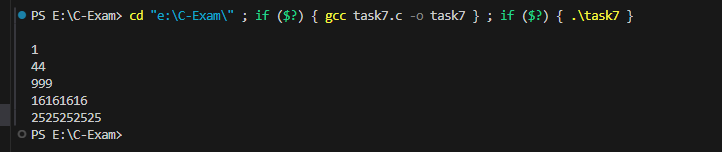

#output

##Create a C program to check if a character entered by the user is a vowel or consonant using a switch statement

##Create a C program to find the largest element in an 1D array.

##Write a C program that defines a function to reverse a string without using any library functions.

##Write a C program to find square of each elements of an 1D array using Pointer.

##Develop a C program that defines a structure representing a car (with attributes like model, year, and price). List N number of cars' details using Array of objects.

##Print a below pattern using nested for loop in C language:14 49 9 916 16 16 1625 25 25 25 25

